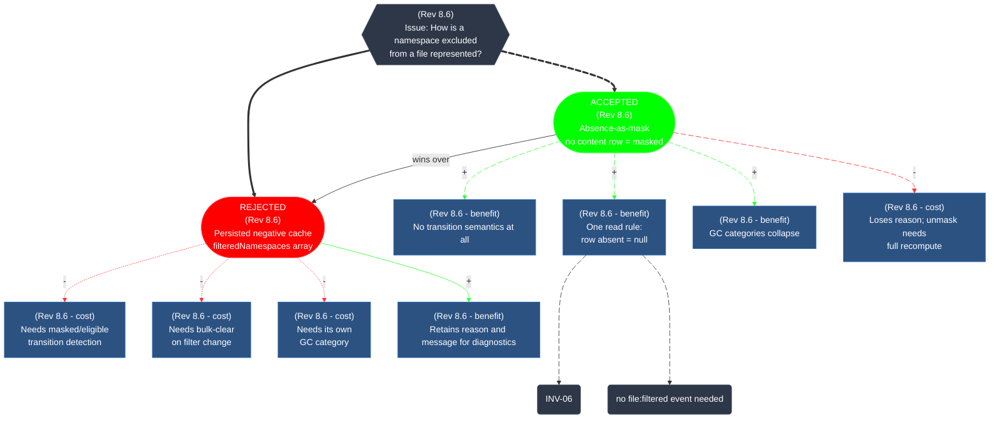

# Decision records (IBIS diagrams)

Structural decisions and their reasoning. These grow — a resolved
position may reappear as an argument under a later issue.

Decisions are often a spec's tombstone. Removal of entries from a spec —
invariants, rules, columns, events, whole sections — is recorded in
decisions with their rationale, and any invariant or rule numbers are
retired, never re-used. A spec describes the current design only;
dismissed alternatives live in decisions and are cited from the prose
only where a current rationale requires it.

One IBIS diagram = one DECISION record = one issue. If a question splits
into genuinely distinct questions, the old issue stays and a new issue
opens (a new diagram); if a question gets a better answer, the old
position is rejected within the same issue. The graph is the record;
any prose beneath it is commentary, not normative.

This skill is the authoritative source for this notation — update it
directly if the notation changes.

## Format rules

Each diagram is maintained as a Mermaid `flowchart` graph.

| #          | Rule                                                                                                                                                                                                                                                                                                                                                                                                                                                                             |
| ---------- | -------------------------------------------------------------------------------------------------------------------------------------------------------------------------------------------------------------------------------------------------------------------------------------------------------------------------------------------------------------------------------------------------------------------------------------------------------------------------------- |
| **IBIS-1** | An IBIS is bounded by its **issue**. Positions, be they the proposition or an argument, are numbered uniquely within the issue only — `P009` in one issue and `P009` in another are unrelated nodes, and that's fine. An issue is likely to go dormant, but is never considered final.                                                                                                                                                                                           |
| **IBIS-2** | Every node carries a **rev tag** (`Rev N.N`) in its text — the revision number that was active when it was added.                                                                                                                                                                                                                                                                                                                                                                |
| **IBIS-3** | The **badge** inside a node's text is the role marker. A proposition (position promoted/demoted by edges) carries `ACCEPTED` or `REJECTED`, judged within the issue. An argument carries `cost` or `benefit`, judged in isolation on its own, e.g. `(Rev 8.6 - cost)`. Shape follows the badge: propositions are stadium nodes `(["..."])`, arguments are rectangles `["..."]`; the issue is a hexagon `{{...}}` and a consequence is a rounded node `(...)`.                    |
| **IBIS-4** | **Every pro/con edge is labeled `+` or `-`** — a pro or con conclusion on the argument by the position pointing to it.                                                                                                                                                                                                                                                                                                                                                           |
| **IBIS-5** | **A `wins over` edge encodes supersession.** There is exactly one proposition within a decision with the `ACCEPTED` badge. The current accepted position points to the previously accepted proposition, now badged `REJECTED`, with the label `wins over`. The edge is what makes the history navigable.                                                                                                                                                                         |
| **IBIS-6** | **Link IDs are typed prefixes + a 3-digit suffix, chosen once per edge, never re-used within an issue, starting at `001` per prefix:** `ip001`, `pro001`, `con001`, `win001`, `thus001`, … (see edge catalog below). Animation, if used, follows the ACCEPTED position's chain: the `ip` edge to the ACCEPTED position, its `pro` and `con` edges, and its `thus` edges.                                                                                                         |
| **IBIS-7** | **`thus` edges** connect an argument or position to a consequence node (text), using the long-dash arrow `--->` (sinks to the bottom, distinct from pro/con). The connection style is uniform: `--->` only. The `thus` set is the **minimal jointly necessary and sufficient conditions for the consequence** — if one edge suffices, there is one; no consequence has two `thus` parents. If the accepted position changes, its no-longer-valid `thus` connections are removed. |

### Edge catalog

| Prefix | Meaning                         | Label                    | Arrow            |
| ------ | ------------------------------- | ------------------------ | ---------------- |
| `ip`   | issue → position (billboard)    | none                     | `==>` thick      |
| `pro`  | benefit argument                | `+`                      | `-->` thin       |
| `con`  | cost argument                   | `-`                      | `-.->` dotted    |
| `win`  | supersession                    | `wins over` (no `+`/`-`) | `-->`            |
| `thus` | argument/position → consequence | none                     | `--->` long-dash |

Edge syntax: `<src> <id>@<arrow> <dst>`, with any label inside the
arrow: `P002 win001@-- "wins over" --> P001`,
`P001 con001@-. "-" .-> P003["..."]`, `P008 thus001@---> C002("...")`.

## Standard classDef block

Every diagram uses this style block verbatim, with a `class` assignment
for every node and edge:

```
classDef issue fill:#2d3748,stroke:#4a5568,color:#fff
classDef rejected fill:#f00,stroke:#f33,color:#fff
classDef accepted fill:#0f0,stroke:#3f3,color:#fff
classDef argument fill:#2c5282,stroke:#2b6cb0,color:#fff
classDef consequence fill:#2d3748,stroke:#4a5568,color:#fff
classDef linkPro stroke:#3f3
classDef linkCon stroke:#f33
class I011 issue
class P001 rejected
class P002 accepted
class P003,P004,P005,P006,P007,P008,P009,P010 argument
class C002,C003 consequence
class pro001,pro002,pro003,pro004 linkPro
class con001,con002,con003,con004 linkCon
```

## Maintenance

A new revision that changes a decision's answer edits the IBIS **in
place**:

1. Flip the old position's badge from `ACCEPTED` to `REJECTED` (and its
   class from `accepted` to `rejected`).
2. Add a `win` edge labeled `wins over` from the new `ACCEPTED`
   position to the old one.
3. Append new arguments as nodes.
4. Remove `thus` edges whose accepted-position parent no longer holds.

A wholly new issue opens a new IBIS diagram. Older records are brought
inline with this format when they are touched.

## Worked example



## Checklist

Before committing a new or revised decision record, confirm:

- [ ] Exactly one `ACCEPTED` node; every previously-accepted position
      reachable via the `wins over` chain
- [ ] Every node carries a `Rev N.N` tag
- [ ] Every argument badged `cost` or `benefit`; every pro/con edge
      labeled `+`/`-` with matching prefix/arrow style
- [ ] Edge IDs use typed prefixes with 3-digit suffixes starting at
      `001`, none re-used
- [ ] `thus` edges are minimal jointly-sufficient; no consequence has
      two `thus` parents; none dangle from rejected positions
- [ ] Standard classDef block present; animation (if any) only on the
      ACCEPTED chain
- [ ] Retired spec numbers cited in the record, not re-used in the spec
