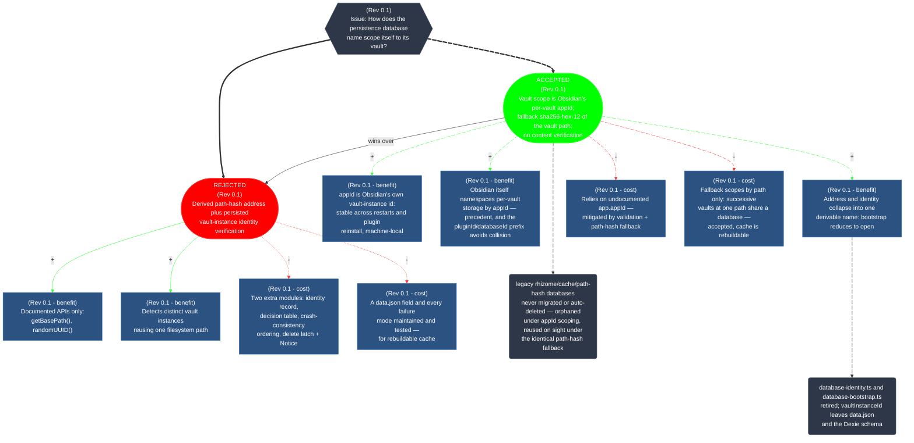
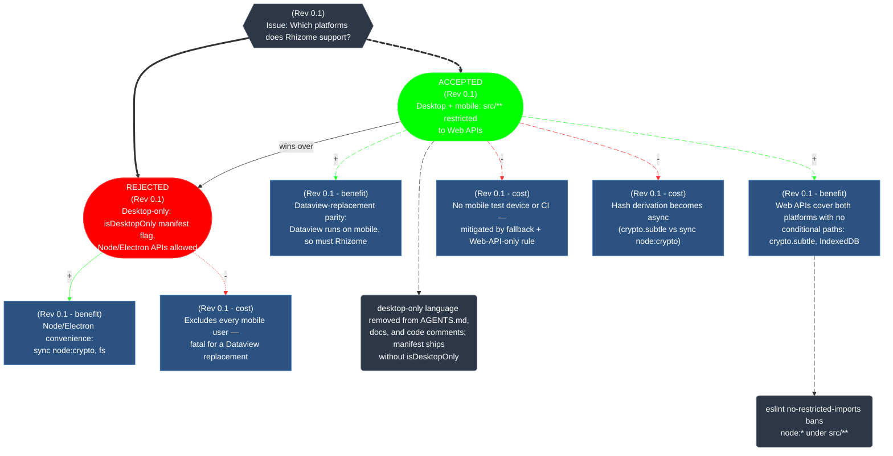

## Decisions

Structural decisions and their reasoning. These grow; a resolved position may appear as an argument under a later issue.

**This section is the spec's tombstone.** Entries removed from the normative sections — invariants, rules, columns, events, whole sections — are recorded here with their rationale, and their numbers are retired, never re-used. The normative prose (§1–§12, §14) describes the current design only; dismissed alternatives are documented here, cited from the prose only where a current rule's rationale requires it.

### Format rules

Each Issue-Based Information System (IBIS) diagram is a **DECISION record for one issue**, maintained as a Mermaid graph. The issue is the scope: if a question splits into genuinely distinct questions, the old issue stays and a new one opens; if a question gets a better answer, the old position is rejected within the same issue.

| #          | Rule                                                                                                                                                                                                                                                                                                                                                                                                                                                                                                                          |
| ---------- | ----------------------------------------------------------------------------------------------------------------------------------------------------------------------------------------------------------------------------------------------------------------------------------------------------------------------------------------------------------------------------------------------------------------------------------------------------------------------------------------------------------------------------- |
| **IBIS-1** | An IBIS is bounded by its **issue**. Position and argument numbering are unique within the issue only — P009 in one issue and P009 in another are unrelated nodes, and that's fine. An issue is closed only when the question is definitively settled and will not be reopened.                                                                                                                                                                                                                                               |
| **IBIS-2** | Every node carries a **rev tag** (`Rev N.N`) in its text — the revision where it was added. The tag is precise, not a placeholder: `Rev 8.6` is known; `Rev ?.?` is a drafting artifact and must be resolved before merging.                                                                                                                                                                                                                                                                                                  |
| **IBIS-3** | Positions and arguments have the same box shape. A position is just an argument that has been promoted (or demoted) by edges; the difference is the **badge** (`ACCEPTED`, `REJECTED`, or none) inside its text.                                                                                                                                                                                                                                                                                                              |
| **IBIS-4** | **Every edge is labeled `+` or `-`** — a pro or con for the head position. An argument that is a cost in one issue and a benefit in another keeps its intrinsic tag; the edge from its parent says which way it cuts.                                                                                                                                                                                                                                                                                                         |
| **IBIS-5** | **A `wins over` edge encodes supersession.** The newer position points to the older with the label `wins over`; the older's badge flips from `ACCEPTED` to `REJECTED`. The badge alone is not sufficient — the edge is what makes the history navigable and the tombstone's rules enforce that.                                                                                                                                                                                                                               |
| **IBIS-6** | **Positions may carry a cost or benefit tag** following the rev-tag line, e.g. `(Rev 8.6 - cost )` — used only where the position's value is intrinsic to the position on its own. Only the edge label carries the parent's valuation.                                                                                                                                                                                                                                                                                        |
| **IBIS-7** | **Link IDs are typed prefixes + a 3-digit suffix, chosen once per edge, never re-used within an issue:** `pro` (pro — label `+`, thin arrow `-->`), `con` (con — label `-`, dotted arrow `-.->`), `win` (supersession — plain arrow `-->`, the relation is the label, no `+`/`-`), and `ip` (issue → a position — thick arrow `==>`, the billboard edge). Animation, if used, follows the ACCEPTED position's chain: from the issue down `win` edges to the ACCEPTED position, and from there down its `pro` and `con` edges. |
| **IBIS-8** | **`thus` edges** connect an argument or position to a consequence node (text), using the long-dash arrow `--->` (sinks to the bottom, distinct from pro/con). The connection style is uniform: `--->` only. The `thus` set is the **minimal jointly necessary and sufficient conditions for the consequence** — if one edge suffices, there is one; no consequence has two `thus` parents. If the accepted position changes, its no-longer-valid `thus` connections are removed.                                              |

**Maintenance.** A new revision that changes a decision's answer edits the IBIS: the old position is rejected with a `wins over` edge to the new one, and new arguments are appended as nodes. A wholly new issue opens a new IBIS. The graph is the record; the text beneath it (if any) is commentary, not normative. Previous decisions will be brought inline with this new modeling format when they are touched.

### Mermaid decision diagram styling

This mermaid snippet is used to style the decision diagrams consistently.

```mermaid
  classDef issue fill:#2d3748,stroke:#4a5568,color:#fff
  classDef rejected fill:#f00,stroke:#f33,color:#fff
  classDef accepted fill:#0f0,stroke:#3f3,color:#fff
  classDef argument fill:#2c5282,stroke:#2b6cb0,color:#fff
  classDef consequence fill:#2d3748,stroke:#4a5568,color:#fff
  classDef linkPro stroke:#3f3
  classDef linkCon stroke:#f33
```

Edges to and from the ACCEPTED position are animated: `edgeName@{ animate: true }`.

### Persistence database naming (Rev 0.1)



### Platform support (Rev 0.1)


